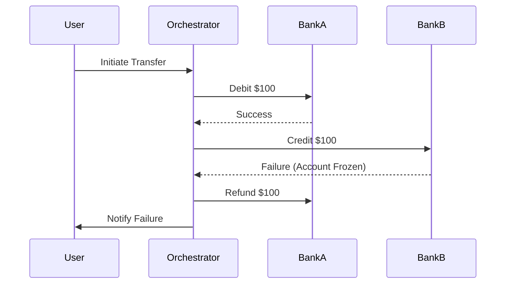

## **Introduction**

In distributed systems, maintaining data consistency across multiple services is challenging, especially in financial applications where transactions must be atomic and reliable. The **SAGA pattern** is a design pattern that helps manage distributed transactions by breaking them into smaller, manageable steps that can be rolled back if something goes wrong.

In this blog, we'll explore:

* What the SAGA pattern is
    
* Why it's crucial for fintech applications
    
* Different types of SAGA implementations
    
* Real-world examples in financial systems
    
* Best practices and challenges
    

---

## **1\. What is the SAGA Pattern?**

The **SAGA pattern** is a way to handle **long-running distributed transactions** by splitting them into a sequence of smaller, local transactions. If any step fails, compensating transactions (rollbacks) are executed to maintain consistency.

### **Key Concepts:**

* **Choreography-Based SAGA**: Services communicate via events (decoupled).
    
* **Orchestration-Based SAGA**: A central coordinator manages the flow.
    
* **Compensating Transactions**: Actions to undo previous steps if a failure occurs.
    

---

## **2\. Why is SAGA Important in Fintech?**

Financial systems require **ACID-like behavior** (Atomicity, Consistency, Isolation, Durability) even in microservices architectures. Traditional distributed transactions (2PC) are slow and don’t scale well.

### **Use Cases in Fintech:**

✅ **Money Transfers** (between accounts in different services)  
✅ **Loan Processing** (credit check → approval → disbursement)  
✅ **Stock Trading** (order placement → payment → settlement)  
✅ **Payment Refunds** (reverse transactions if any step fails)

---

## **3\. Types of SAGA Implementations**

### **A. Choreography-Based SAGA (Event-Driven)**

* **How it works**: Each service emits events after completing its step.
    
* **Pros**: Decoupled, scalable.
    
* **Cons**: Hard to debug (no central tracking).
    

#### **Example: Payment Processing**

1. **Order Service** → "Order Created" event
    
2. **Payment Service** → "Payment Processed" event
    
3. **Inventory Service** → "Stock Reserved" event  
    If any step fails, compensating events trigger rollbacks.
    

### **B. Orchestration-Based SAGA (Centralized Control)**

* **How it works**: A **SAGA orchestrator** manages the flow.
    
* **Pros**: Easier to monitor, explicit rollback logic.
    
* **Cons**: Single point of failure (orchestrator).
    

#### **Example: Loan Approval**

1. Orchestrator → "Start Credit Check"
    
2. Orchestrator → "Verify Employment"
    
3. Orchestrator → "Approve Loan"  
    If any step fails, the orchestrator triggers compensating actions.
    

---

## **4\. Real-World Example: Money Transfer Between Banks**

Consider a transfer between **Bank A** and **Bank B**:

1. **Debit Bank A**
    
2. **Credit Bank B**
    
3. **Update Transaction Log**
    

### **What if Step 2 Fails?**

* **Compensating Action**: Refund Bank A and log failure.
    

### **SAGA Flow:**

---

## **5\. Best Practices & Challenges**

### **Best Practices:**

✔ **Idempotency**: Ensure retries don’t cause duplicate transactions.  
✔ **Eventual Consistency**: Accept that systems may be temporarily inconsistent.  
✔ **Logging & Monitoring**: Track each step for debugging.  
✔ **Timeouts**: Avoid indefinitely hanging transactions.

### **Challenges:**

⚠ **Complex Rollbacks**: Compensating logic can get complicated.  
⚠ **Debugging Difficulty**: Hard to trace in event-driven systems.  
⚠ **Partial Failures**: Some steps succeed while others fail.

---

## **6\. Conclusion**

The **SAGA pattern** is a powerful way to manage distributed transactions in fintech, ensuring reliability without tight coupling.

* Use **Choreography** for scalability.
    
* Use **Orchestration** for better control.
    
* Always design **compensating transactions** carefully.
    

By implementing SAGA correctly, fintech systems can achieve **high consistency** while remaining **scalable and resilient**.

---

### **Further Reading**

📖 [Pattern: Saga (](https://microservices.io/patterns/data/saga.html)[microservices.io](http://microservices.io)[)](https://microservices.io/patterns/data/saga.html)  
📖 [Managing Data in Microservices (Martin Fowler)](https://martinfowler.com/articles/patterns-of-distributed-systems/saga.html)

Would you like a **code implementation example** in Python or a deeper dive into **error handling strategies**? Let me know! 🚀